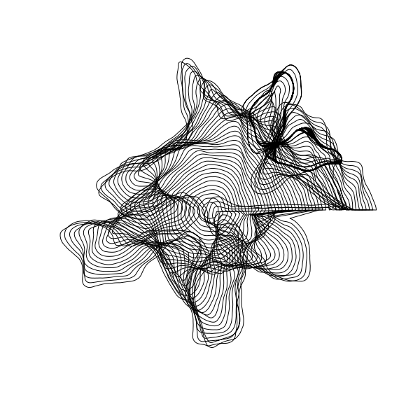
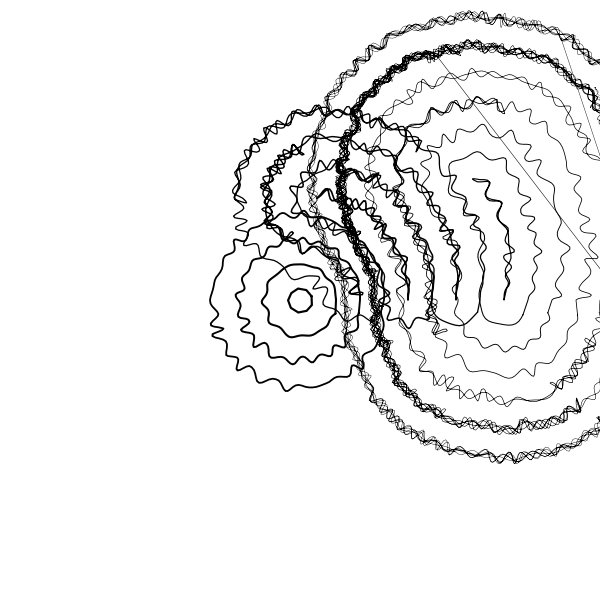

A generative art idea inspired by inconvergent's Differential Line and doodles I make during lecture.

A particle steers around following a contour as best as it can, but small deviations occur from random noise and steering erros. The path it traces out (hopefully) makes something like a hand-drawn doodle.

I was going to make sure the contours don't intersect but that can be intersting too:

Bugs can be interesting!
